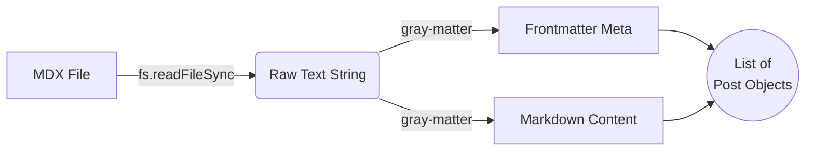
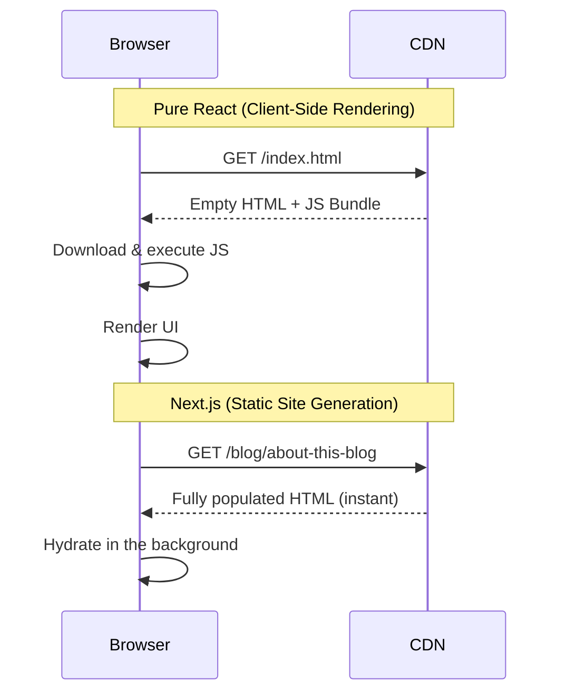

This is a walkthrough of how this blog actually works — every page, every
library, every design decision — written so you can clone the approach for your
own site. It moves from **structure** to the **content pipeline**, then the
**features**, the **design choices**, and finally **hosting**. Every feature it
describes is demonstrated live in this very post.

<Callout>
  **Note**: This is a living project. Everything below reflects the real code in
  the repository as of **June 2026** — the file paths and library versions are
  the ones actually shipping.
</Callout>

## Site structure: the pages

The site is a small Next.js **App Router** project. Routing is driven by the
file system: each folder under `src/app` with a `page.tsx` becomes a route.

- **Home** (`src/app/page.tsx`) — a short intro/landing hero plus the most
  recent posts.
- **Blog index** (`src/app/blog/page.tsx`) — the full archive of every article.
- **Post** (`src/app/blog/[slug]/page.tsx`) — the dynamic route that renders a
  single article (this page).
- **About** (`src/app/about/page.tsx`) — who the author is.
- **Imprint** (`src/app/imprint/page.tsx`) — a legal *Impressum*. In Germany and
  much of the EU, any public-facing site needs one by law; if you publish from
  there, budget for this page.

### File-system routing and the `[slug]` segment

In a classic React app you'd reach for React Router and declare
`<Route path="/blog/:id" />`. Next's App Router replaces that with folders. A
folder named `[slug]` is a **dynamic segment**: visiting `/blog/about-this-blog`
loads `src/app/blog/[slug]/page.tsx` and hands it `"about-this-blog"` as
`params.slug`. Because we statically export, `generateStaticParams()` enumerates
every slug at build time so each post becomes its own pre-rendered HTML file.

### From `.mdx` files to a post list

Posts are plain `.mdx` files in `src/content/posts`. At build time
`src/lib/posts.ts` runs in Node and turns them into structured data:

1. `fs.readdirSync` lists every file in the posts folder.
2. `fs.readFileSync` reads each file's raw text.
3. `gray-matter` splits the YAML **frontmatter** (the block between `---` fences)
   from the Markdown body.
4. The same helper derives extras the UI needs: a word count, a reading-time
   estimate, and the heading list that powers the table of contents.



The rendered body is produced by `MDXRemote` from `next-mdx-remote/rsc`, which
evaluates the Markdown **on the server during the build** and maps standard tags
(`h2`, `p`, `pre`, …) to Tailwind-styled React components — which is how a custom
`<Callout>` like the one above can live right inside the Markdown.

## The reading-time indicator

The post header shows an **"X min read"** estimate next to the byline. It is
computed at build time in `src/lib/posts.ts` from the body's word count
(`post.readingTime`), assuming ~200 words per minute and rounding up to at least
one minute. It costs nothing at runtime and it sets expectations: a reader
deciding whether to start a long deep dive benefits from knowing it's a 12-minute
commitment rather than a two-minute note.

## "On this page": the table of contents

Long technical articles need in-page navigation. The `TableOfContents`
component renders the **"On this page"** list you can see as a sticky sidebar on
wide screens (and a collapsible block on mobile). It is built from
`post.headings` — derived at build time, not by scraping the DOM in the browser.

Two rehype plugins make the anchors work:

- `rehype-slug` gives every heading a stable `id` (e.g. `#the-reading-time-indicator`).
- `rehype-autolink-headings` appends a shareable anchor link that appears when
  you hover a heading.

To keep the sidebar slugs identical to the rendered `id`s, `posts.ts` uses the
same `github-slugger` algorithm rehype uses.

### Heading hierarchy powers the TOC

The component map styles `h2`, `h3`, and `h4` as three visually distinct tiers,
so the generated TOC has a real shape. This `h3` is a second-level entry.

#### A fourth-level heading

…and this `h4` is the deepest tier rendered — a small uppercase label. The TOC
indents each level so the document outline is obvious at a glance.

## Why a black-and-white theme

The design is deliberately monochrome and high-contrast. The reasoning:

- **Focus.** With no decorative color, attention lands on the typography and the
  content. Code, diagrams, and prose carry the page.
- **Timelessness.** A neutral palette doesn't date the way a trendy accent color
  does.
- **Accessibility.** High contrast between text and background is easy on the
  eyes and friendly to contrast requirements.

It also pairs cleanly with a **manual** light/dark toggle.

### `darkMode: 'class'` vs `media`

Tailwind's default `media` strategy follows the operating system theme. We use
the `class` strategy instead so the on-page toggle is authoritative, not the OS.
The trade-off is a flash of the wrong theme on first paint (FOUC) — solved by a
tiny render-blocking script in `src/app/layout.tsx` that reads `localStorage`
and adds the `.dark` class to `<html>` *before* the first paint.

### The Mermaid wireframe inversion

Diagrams are rendered by `mermaid`, but instead of fighting its theming engine
we force every diagram to a strict black-on-white "blueprint" in `globals.css`,
then wrap the SVG in a `dark:invert` container. In light mode you get a clean
black-on-white sketch; in dark mode the browser inverts it to white-on-black —
no JavaScript redraw required. Here's the classic CSR-vs-SSG comparison the rest
of the site relies on, rendered through exactly that path:



## The rendering libraries

Here is every capability mapped to the library that provides it and the version
shipping in `package.json`:

| Capability | Library | Version |
|---|---|---|
| Framework / SSG | `next` | 16.2.1 |
| UI runtime | `react` / `react-dom` | 19.2.4 |
| MDX rendering | `next-mdx-remote` | ^6.0.0 |
| MDX loader / config | `@next/mdx`, `@mdx-js/loader`, `@mdx-js/react` | ^16.2.1 / ^3.1.1 / ^3.1.1 |
| Frontmatter parsing | `gray-matter` | ^4.0.3 |
| GFM (tables, etc.) | `remark-gfm` | ^4.0.1 |
| Code blocks + highlighting | `rehype-pretty-code` + `shiki` | ^0.14.3 / ^4.3.0 |
| Heading IDs + anchors | `rehype-slug` + `rehype-autolink-headings` + `github-slugger` | ^6.0.0 / ^7.1.0 / ^2.0.0 |
| Math (KaTeX) | `remark-math` + `rehype-katex` + `katex` | ^6.0.0 / ^7.0.1 / ^0.17.0 |
| Diagrams | `mermaid` | ^11.14.0 |
| Styling | `tailwindcss` + `@tailwindcss/typography` | ^4.2.2 / ^0.5.19 |

The whole pipeline is assembled once in `src/lib/mdx.ts` and runs **at build
time** — there is no client-side highlighting library and no hydration cost for
code. Two details are worth calling out: a custom rehype plugin rewrites
` ```mermaid ` blocks into a `<mermaid>` element *before* the highlighter runs,
so diagrams never get tokenized; and `CodeBlock.tsx` wraps the highlighted
`<pre>` to add the copy button and language label.

### Syntax highlighting at build time

Code is highlighted by Shiki during the build, with a dual light/dark theme and
support for titles and line ranges. The snippet below uses a filename title, a
highlighted range, and line numbers:

```ts title="reading-time.ts" {2,4-6} showLineNumbers
export function readingTime(words: number): number {
  const WORDS_PER_MINUTE = 200
  // Round up so even a short note reads as "1 min read".
  return Math.max(1, Math.round(words / WORDS_PER_MINUTE))
}

console.log(readingTime(1000)) // => 5
```

A shell block, highlighted the same way:

```bash
npm run build
npx serve out
```

### Math with KaTeX

Inline math such as $E = mc^2$ flows with the text, and display math gets its
own centered block:

$$
\text{attention}(Q, K, V) = \text{softmax}\!\left(\frac{QK^\top}{\sqrt{d_k}}\right) V
$$

### Lists for tutorials

Ordered steps, with a nested bullet list, render with correct markers at every
depth:

1. Install the dependencies.
2. Configure the MDX pipeline in `src/lib/mdx.ts`.
3. Verify the build:
   - Run `npm run build`.
   - Open `out/index.html`.
   - Confirm the highlighted code renders.
4. Ship it.

## The rest of the features

A few smaller pieces complete the picture:

- **Copy-to-clipboard.** Every code block gets an accessible copy button
  (`CodeBlock.tsx`), with an `aria-label` and a "copied" state.
- **Dual Shiki themes via CSS variables.** Each token carries
  `--shiki-light` / `--shiki-dark`; `globals.css` picks which applies based on
  the `.dark` class, so highlighting follows the theme toggle with no re-render.
- **Inline-SVG brand icons.** The footer's GitHub/LinkedIn marks are raw
  `<svg>` paths with `fill="currentColor"` — zero network requests, infinitely
  scalable, and themeable with a Tailwind text-color class.
- **`DynamicLogo`.** A small client component for the header wordmark.
- **SEO via the Metadata API.** `src/app/layout.tsx` exports `metadata` with
  `robots`, OpenGraph, and a `metadataBase`, injected statically into `<head>`.
- **RSS feed.** `src/app/rss.xml/route.ts` is a static route handler
  (`dynamic = 'force-static'`) that emits a valid feed, linked from `<head>` via
  the `alternates` field in the layout metadata.
- **Sitemap.** `src/app/sitemap.ts` enumerates every route for crawlers.
- **Shared constants.** Site URL, author, and description live once in
  `src/lib/site.ts`, so the feed, sitemap, and metadata never drift apart.

## Hosting on GitHub Pages

### `output: 'export'` and the Actions workflow

`next.config.mjs` sets `output: 'export'`, so `npm run build` emits a fully
static `out/` directory — plain HTML, CSS, and JS with no server runtime. Every
feature above is therefore a *build-time* feature; that constraint is what keeps
the site hostable anywhere.

Deployment is automated by `.github/workflows/deploy.yml`: on every push to
`main` it installs dependencies, runs `next build`, uploads `out/` as a Pages
artifact, and deploys it.

### Why the domain carries your name

GitHub Pages has two conventions:

- A **user/organization site** — a repo named exactly `<username>.github.io` —
  is served at `https://<username>.github.io` with **no base path**. That's why
  this site lives at `artemgilmanov.github.io`: the repository is named after the
  account.
- A **project site** — any other repo — is served under a sub-path like
  `https://<username>.github.io/<repo>/`, which means you must set `basePath` and
  `assetPrefix` so assets resolve correctly.

Naming the repo after yourself avoids the base-path dance entirely. You can layer
a custom domain on top later by adding a `CNAME` file.

## Build your own

The minimal recipe, distilled:

1. A **Next.js** app with `output: 'export'`.
2. **MDX** content rendered with `next-mdx-remote`, frontmatter parsed by
   `gray-matter`.
3. A **rehype/remark pipeline** for the features you want — highlighting, a TOC,
   math, diagrams.
4. A repo named **`<username>.github.io`**.
5. The **GitHub Actions Pages workflow** to build and deploy on push.

That's the whole stack. Everything else in this post is detail layered on top of
those five pieces.
