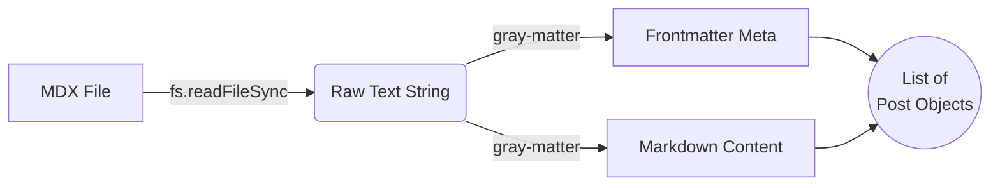
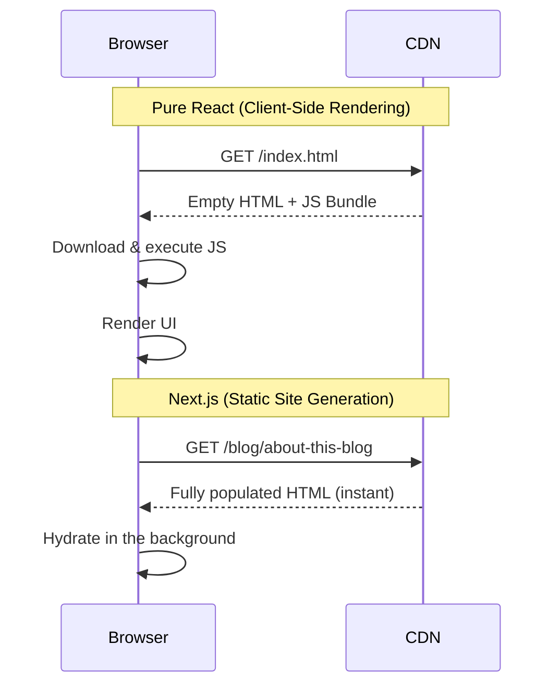

This is a walkthrough of how this blog actually works — every page, every
library, every design decision — written so you can clone the approach for your
own site. It moves from **structure** to the **content pipeline**, then the
**features**, the **design choices**, and finally **hosting**. Every feature it
describes is demonstrated live in this very post.

<Callout>
  **Note**: This is a living project. Everything below reflects the real code in
  the repository as of **June 2026** — the file paths and library versions are
  the ones actually shipping.
</Callout>

## Core Concepts

- **Rendering** means *turning code and data into the HTML a browser
  displays*. The important question is *when and where* it happens, and there are
  three common answers:
  - **CSR (client-side rendering).** The server sends a near-empty page plus a
    JavaScript bundle; the browser runs the JavaScript and builds the page on
    your device. This is how a plain React app, for example, works. The page is blank until the
    script finishes downloading and running.
  - **SSR (server-side rendering).** A server builds the finished HTML *for each
    request*, on the fly, then sends it. The page arrives ready to read, but you
    need a running server.
  - **SSG (static site generation).** The HTML is built *once, ahead of time*
    (at "build time"), saved as plain files, and served as-is to everyone. No
    server logic runs when a visitor arrives. **This blog uses SSG**, which is
    why it can be hosted on simple static hosting like GitHub Pages.
- **Build time vs. runtime.** *Build time* is when you run the build command on
  your own machine (or in CI) to produce the final files. *Runtime* is when a
  visitor's browser actually loads the page. A big theme of this post is that
  almost everything here happens at build time, so there's little left to do at
  runtime.
- **Hydration.** With SSG/SSR the browser first receives finished HTML it can
  show immediately. *Hydration* is the follow-up step where React loads in the
  background and "attaches" to that existing HTML so interactive bits (buttons,
  toggles) start working — without re-drawing the page. Think of it as wiring up
  the electrics in a house that's already built.
- **MDX.** Markdown (the simple `# heading` / `**bold**` text format) extended
  so you can drop React components straight into the prose — that's how the
  `<Callout>` boxes in this post exist inside otherwise-plain Markdown.
- **Frontmatter.** The little block of metadata at the very top of a content
  file, fenced by `---` lines (title, date, tags). It travels with the content
  but isn't shown as body text.
- **remark / rehype.** These are the plugin systems that add features on top of
  plain Markdown during the build. Markdown on its own only knows basics —
  headings, bold, links, lists; it has no idea what "syntax-highlighted code" or
  "a clickable table of contents" is. remark and rehype are the machinery that
  adds those, and they do it at build time so the reader's browser never has to.
  There are two because the build converts a post in two stages, and each system
  works on a different one: the `.mdx` file is first parsed into a tree
  representing the **Markdown**, which *remark* plugins edit; that tree is then
  converted into a tree representing the output **HTML**, which *rehype* plugins
  edit; only then is HTML produced. Nearly every feature in this blog is exactly
  one plugin doing one job:
  - The **"On this page" table of contents** works because `rehype-slug` gives
    every heading a stable `id` and `rehype-autolink-headings` makes each heading
    linkable — so the navigation is generated straight from the post's own
    headers, automatically.
  - **Highlighted code** is `rehype-pretty-code`; **math** is `remark-math` +
    `rehype-katex`; **GitHub-style tables** are `remark-gfm`; **diagrams** are a
    small custom rehype plugin. Add the plugin, get the feature.

  The point is leverage: instead of writing your own Markdown parser, you bolt on
  one small, well-tested plugin per feature — and since it all runs at build
  time, none of it costs the reader anything at runtime.
- **FOUC (flash of unstyled/wrong content).** The brief moment where a page shows
  the wrong appearance before a script corrects it — for example flashing the
  light theme for an instant before switching to dark.

## Site structure: the pages

The site is a small Next.js **App Router** project. Routing is driven by the
file system: each folder under `src/app` with a `page.tsx` becomes a route.

- **Home** (`src/app/page.tsx`) — a short intro/landing hero plus the most
  recent posts.
- **Blog index** (`src/app/blog/page.tsx`) — the full archive of every article.
- **Post** (`src/app/blog/[slug]/page.tsx`) — the dynamic route that renders a
  single article (this page).
- **About** (`src/app/about/page.tsx`) — who the author is.
- **Imprint** (`src/app/imprint/page.tsx`) — a legal *Impressum*. In Germany and
  much of the EU, any public-facing commercial site needs one by law. The German
  requirement now lives in [§ 5 of the Digitale-Dienste-Gesetz (DDG)](https://www.gesetze-im-internet.de/ddg/__5.html),
  which replaced the old § 5 *Telemediengesetz* (TMG) in May 2024; missing or
  incomplete imprints can be fined up to €50,000. If you publish from there,
  budget for this page.

### File-system routing and the `[slug]` segment

In a classic React app you'd reach for React Router and declare
`<Route path="/blog/:id" />`. Next's App Router replaces that with folders. A
folder named `[slug]` is a **dynamic segment**: visiting `/blog/about-this-blog`
loads `src/app/blog/[slug]/page.tsx` and hands it `"about-this-blog"` as
`params.slug`. Because we statically export, `generateStaticParams()` enumerates
every slug at build time so each post becomes its own pre-rendered HTML file.

### From `.mdx` files to a post list

Posts are plain `.mdx` files in `src/content/posts`. At build time
`src/lib/posts.ts` runs in Node and turns them into structured data:

1. `fs.readdirSync` lists every file in the posts folder.
2. `fs.readFileSync` reads each file's raw text.
3. `gray-matter` splits the YAML **frontmatter** (the block between `---` fences)
   from the Markdown body.
4. The same helper derives extras the UI needs: a word count, a reading-time
   estimate, and the heading list that powers the table of contents.



The rendered body is produced by `MDXRemote` from `next-mdx-remote/rsc`, which
evaluates the Markdown **on the server during the build** and maps standard tags
(`h2`, `p`, `pre`, …) to Tailwind-styled React components — which is how a custom
`<Callout>` like the one above can live right inside the Markdown.

## The reading-time indicator

The post header shows an **"X min read"** estimate next to the byline. It is
computed at build time in `src/lib/posts.ts` from the body's word count
(`post.readingTime`), assuming ~200 words per minute and rounding up to at least
one minute. It costs nothing at runtime and it sets expectations: a reader
deciding whether to start a long deep dive benefits from knowing it's a 12-minute
commitment rather than a two-minute note.

## "On this page": the table of contents

Long technical articles need in-page navigation. The `TableOfContents`
component renders the **"On this page"** list you can see as a sticky sidebar on
wide screens (and a collapsible block on mobile). It is built from
`post.headings` — derived at build time, not by scraping the DOM in the browser.

Two rehype plugins make the anchors work:

- `rehype-slug` gives every heading a stable `id` (e.g. `#the-reading-time-indicator`).
- `rehype-autolink-headings` appends a shareable anchor link that appears when
  you hover a heading.

To keep the sidebar slugs identical to the rendered `id`s, `posts.ts` uses the
same `github-slugger` algorithm rehype uses.

### Heading hierarchy powers the TOC

The component map styles `h2`, `h3`, and `h4` as three visually distinct tiers,
so the generated TOC (table of contents) has a real shape. This `h3` is a
second-level entry.

#### A fourth-level heading

…and this `h4` is the deepest tier rendered — a small uppercase label. The TOC
indents each level so the document outline is obvious at a glance.

## Why a black-and-white theme

The design is deliberately monochrome and high-contrast. The reasoning:

- **Focus.** With no decorative color, attention lands on the typography and the
  content. Code, diagrams, and prose carry the page.
- **Timelessness.** A neutral palette doesn't date the way a trendy accent color
  does.
- **Accessibility.** High contrast between text and background is easy on the
  eyes and friendly to contrast requirements.

It also pairs cleanly with a **manual** light/dark toggle.

### `darkMode: 'class'` vs `media`

Tailwind's default `media` strategy follows the operating system theme. We use
the `class` strategy instead so the on-page toggle is authoritative, not the OS.
The trade-off is a flash of the wrong theme on first paint (FOUC) — solved by a
tiny render-blocking script in `src/app/layout.tsx` that reads `localStorage`
and adds the `.dark` class to `<html>` *before* the first paint.

### The Mermaid wireframe inversion

Diagrams are rendered by `mermaid`, but instead of fighting its theming engine
we force every diagram to a strict black-on-white "blueprint" in `globals.css`,
then wrap the SVG in a `dark:invert` container. In light mode you get a clean
black-on-white sketch; in dark mode the browser inverts it to white-on-black —
no JavaScript redraw required. Here's the classic comparison between CSR
(client-side rendering) and SSG (static site generation) that the rest of the
site relies on, rendered through exactly that path:



## The rendering libraries

Here is every capability mapped to the library that provides it and the version
shipping in `package.json`:

| Capability | Library | Version |
|---|---|---|
| Framework / SSG (static site generation) | `next` | 16.2.1 |
| UI runtime | `react` / `react-dom` | 19.2.4 |
| MDX rendering | `next-mdx-remote` | ^6.0.0 |
| MDX loader / config | `@next/mdx`, `@mdx-js/loader`, `@mdx-js/react` | ^16.2.1 / ^3.1.1 / ^3.1.1 |
| Frontmatter parsing | `gray-matter` | ^4.0.3 |
| GFM — GitHub Flavored Markdown (tables, etc.) | `remark-gfm` | ^4.0.1 |
| Code blocks + highlighting | `rehype-pretty-code` + `shiki` | ^0.14.3 / ^4.3.0 |
| Heading IDs + anchors | `rehype-slug` + `rehype-autolink-headings` + `github-slugger` | ^6.0.0 / ^7.1.0 / ^2.0.0 |
| Math (KaTeX) | `remark-math` + `rehype-katex` + `katex` | ^6.0.0 / ^7.0.1 / ^0.17.0 |
| Diagrams | `mermaid` | ^11.14.0 |
| Styling | `tailwindcss` + `@tailwindcss/typography` | ^4.2.2 / ^0.5.19 |

Every row above is one library doing one job. They're wired together in a single
file, `src/lib/mdx.ts`, and the whole pipeline runs **at build time** — so
there's no client-side highlighting library to ship and no runtime cost. Three
things are worth knowing about how it fits together:

- **One config, build-time only.** `src/lib/mdx.ts` gathers the remark and rehype
  plugins and hands them to `MDXRemote`; all of it executes during `npm run build`.
- **Diagrams skip the highlighter.** A small custom rehype plugin rewrites Mermaid
  code blocks into a `<mermaid>` element *before* the highlighter runs, so the
  diagram source is never tokenized as code.
- **Code blocks get their UI from `CodeBlock.tsx`**, which wraps each highlighted
  `<pre>` to add the copy button and the language label.

The rest of this section is each capability shown working.

### Code highlighting

Code is highlighted by `rehype-pretty-code` (powered by Shiki) at build time, in
a dual light/dark theme. A fenced block can declare a filename title, a
highlighted line range (`{2,4-6}`), and line numbers (`showLineNumbers`):

```ts title="reading-time.ts" {2,4-6} showLineNumbers
export function readingTime(words: number): number {
  const WORDS_PER_MINUTE = 200
  // Round up so even a short note reads as "1 min read".
  return Math.max(1, Math.round(words / WORDS_PER_MINUTE))
}

console.log(readingTime(1000)) // => 5
```

The same highlighter handles any language — here's a shell block:

```bash
npm run build
npx serve out
```

### Math with KaTeX

`remark-math` finds the math in the Markdown and `rehype-katex` renders it.
Inline math such as $E = mc^2$ flows with the text, and display math gets its
own centered block:

$$
\text{attention}(Q, K, V) = \text{softmax}\!\left(\frac{QK^\top}{\sqrt{d_k}}\right) V
$$

### Lists and tables

`remark-gfm` adds GitHub-Flavored Markdown — the version table above is one
example. Ordered and unordered lists, including nesting, render with correct
markers at every depth:

1. Install the dependencies.
2. Configure the MDX pipeline in `src/lib/mdx.ts`.
3. Verify the build:
   - Run `npm run build`.
   - Open `out/index.html`.
   - Confirm the highlighted code renders.
4. Ship it.

### Copy-to-clipboard on code blocks

Every code block gets an accessible copy button, implemented in `CodeBlock.tsx`.
It's a client component wrapped around the highlighted `<pre>`: a click reads the
block's text and writes it to the clipboard, then shows a brief "copied" state.
The button carries an `aria-label` so screen readers announce it, and it lives in
the code block's title bar so it never covers the code itself.

### Dual Shiki themes via CSS variables

Rather than ship two highlighted copies of every snippet, each token carries two
colors at once — `--shiki-light` and `--shiki-dark` as CSS custom properties.
`globals.css` decides which set applies based on the `.dark` class on `<html>`.
The upshot: switching the theme re-colors all code instantly, with no JavaScript
and no re-highlighting at runtime.

### Inline-SVG brand icons

The footer's GitHub and LinkedIn marks are raw `<svg>` paths embedded directly in
the markup, using SVG (Scalable Vector Graphics). Because they're inline, they
cost zero extra network requests, stay razor-sharp at any size, and — thanks to
`fill="currentColor"` — recolor themselves to match the surrounding text with a
single Tailwind class, so they adapt to light and dark mode for free.

### `DynamicLogo` — a client component for the wordmark

The header wordmark is a small client component. Most of this site is static
HTML, but a few elements need to run in the browser; isolating that logic in a
tiny component keeps the interactive surface area small while leaving everything
around it static.

### SEO via the Metadata API

For SEO (search engine optimization), `src/app/layout.tsx` exports a `metadata`
object using Next.js's Metadata API. Next injects it statically into `<head>` at
build time — `robots` directives (telling crawlers what to index), OpenGraph tags
(controlling how links look when shared on social media), and a `metadataBase`
(the absolute URL other links resolve against). No client-side code is involved.

### RSS feed

`src/app/rss.xml/route.ts` is a static route handler marked
`dynamic = 'force-static'`, so it's generated once at build time as a plain file.
It emits a valid RSS (Really Simple Syndication) feed — the standard format
readers and aggregators use to subscribe to new posts — and it's advertised to
browsers through the `alternates` field in the layout metadata.

### Sitemap

`src/app/sitemap.ts` enumerates every route on the site into a `sitemap.xml`.
Search engines read this file to discover all the pages quickly instead of
relying on link-crawling alone, which helps every post get indexed.

### Shared constants

The site URL, author, and description live in exactly one place,
`src/lib/site.ts`. The feed, sitemap, and page metadata all import from it, so
there's a single source of truth and those values can never drift out of sync as
the site grows.

## Hosting on GitHub Pages

### `output: 'export'` and the Actions workflow

`next.config.mjs` sets `output: 'export'`, so `npm run build` emits a fully
static `out/` directory — plain HTML, CSS, and JS with no server runtime. Every
feature above is therefore a *build-time* feature; that constraint is what keeps
the site hostable anywhere.

Deployment is automated by `.github/workflows/deploy.yml`: on every push to
`main` it installs dependencies, runs `next build`, uploads `out/` as a Pages
artifact, and deploys it.

### Why the domain carries your name

GitHub Pages has two conventions:

- A **user/organization site** — a repo named exactly `<username>.github.io` —
  is served at `https://<username>.github.io` with **no base path**. That's why
  this site lives at `artemgilmanov.github.io`: the repository is named after the
  account.
- A **project site** — any other repo — is served under a sub-path like
  `https://<username>.github.io/<repo>/`, which means you must set `basePath` and
  `assetPrefix` so assets resolve correctly.

Naming the repo after yourself avoids the base-path dance entirely. You can layer
a custom domain on top later by adding a `CNAME` file.

## Build your own

Here is the whole thing as a do-it-yourself guide. Each step is small; follow
them in order and you'll have reproduced this site's foundation.

### 1. Create a Next.js app

```bash
npx create-next-app@latest my-blog
```

Accept the defaults (App Router, TypeScript, Tailwind CSS), then `cd my-blog`.
You now have a site you can run locally with `npm run dev`.

### 2. Switch on static export

A normal Next.js app expects a Node.js server running in production. Setting
**`output: 'export'`** changes that: it tells Next to pre-render every page to
plain HTML, CSS, and JS *at build time* and write the result into an `out/`
folder — with no server needed at runtime. That single setting is what makes the
site hostable on static-only platforms like GitHub Pages.

```js title="next.config.mjs"
import createMDX from '@next/mdx'

/** @type {import('next').NextConfig} */
const nextConfig = {
  output: 'export',                  // pre-render everything to static files in out/
  images: { unoptimized: true },     // the default image optimizer needs a server
  pageExtensions: ['ts', 'tsx', 'md', 'mdx'],
}

const withMDX = createMDX()
export default withMDX(nextConfig)
```

From now on, `npm run build` produces the static `out/` directory you'll deploy.

### 3. Add the MDX content layer

Install the two pieces that turn `.mdx` files into rendered pages:

```bash
npm install next-mdx-remote gray-matter
```

`gray-matter` reads the frontmatter (title, date, tags) off the top of each
file; `next-mdx-remote` renders the Markdown body — including any React
components you embed, like the `<Callout>` boxes in this post.

### 4. Wire up the feature plugins

This is the remark/rehype pipeline from earlier: one plugin per feature, all
running at build time. Install the ones you want:

```bash
npm install rehype-pretty-code shiki rehype-slug rehype-autolink-headings \
  remark-math rehype-katex remark-gfm github-slugger katex
```

Collect them in one place and hand them to `next-mdx-remote`:

```ts title="src/lib/mdx.ts"
import remarkGfm from 'remark-gfm'
import remarkMath from 'remark-math'
import rehypeSlug from 'rehype-slug'
import rehypeAutolinkHeadings from 'rehype-autolink-headings'
import rehypePrettyCode from 'rehype-pretty-code'
import rehypeKatex from 'rehype-katex'

export const mdxOptions = {
  remarkPlugins: [remarkGfm, remarkMath],
  rehypePlugins: [
    rehypeSlug,                                                  // heading ids
    rehypeAutolinkHeadings,                                      // anchor links
    [rehypePrettyCode, { theme: { light: 'github-light', dark: 'github-dark' } }],
    rehypeKatex,                                                 // math
  ],
}
```

Want a feature? Add its plugin. Don't want one? Delete the line.

### 5. Write and load posts

Put each article in `src/content/posts/` as an `.mdx` file that starts with
frontmatter:

```mdx title="src/content/posts/hello.mdx"
---
title: "Hello, world"
date: "2026-06-28"
description: "My first post."
tags: ["meta"]
---

This is **MDX** — Markdown with components, math, code, and diagrams.
```

A small `src/lib/posts.ts` reads that folder with Node's `fs`, parses each file
with `gray-matter`, and returns the list your home page and blog index map over.
Import the KaTeX stylesheet once (`import 'katex/dist/katex.min.css'`) so
equations are styled.

### 6. Name the repository after yourself

Create a GitHub repository named **exactly** `<username>.github.io`. As explained
above, that "user site" convention serves your build at
`https://<username>.github.io` with no base path — so you skip configuring
`basePath` and `assetPrefix`. (You can attach a custom domain later with a
`CNAME` file.)

### 7. Deploy automatically on every push

Add the workflow below, then in the repository's **Settings → Pages**, set the
source to **GitHub Actions**. After that, every push to `main` rebuilds and
publishes the site.

```yaml title=".github/workflows/deploy.yml"
name: Deploy to Pages
on:
  push:
    branches: [main]
permissions:
  contents: read
  pages: write
  id-token: write
jobs:
  build:
    runs-on: ubuntu-latest
    steps:
      - uses: actions/checkout@v4
      - uses: actions/setup-node@v4
        with: { node-version: 20, cache: npm }
      - run: npm ci
      - run: npm run build
      - uses: actions/upload-pages-artifact@v3
        with: { path: ./out }
  deploy:
    needs: build
    runs-on: ubuntu-latest
    environment: github-pages
    steps:
      - uses: actions/deploy-pages@v4
```

<Callout>
  **That's the whole stack:** a static Next.js app (`output: 'export'`), MDX
  content parsed by `gray-matter`, one plugin per feature, a
  `<username>.github.io` repo, and a workflow that ships on push. Everything else
  in this post is polish layered on top of those seven steps.
</Callout>
