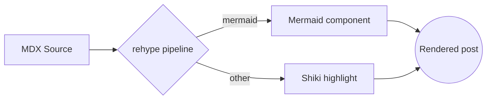

## Syntax highlighting

Code blocks are highlighted at build time with Shiki, in both light and dark
themes. Here is some TypeScript with a title and a highlighted range:

```ts title="reading-time.ts" {2,4-6} showLineNumbers
export function readingTime(words: number): number {
  const WORDS_PER_MINUTE = 200
  // Always round up to at least one minute.
  return Math.max(1, Math.round(words / WORDS_PER_MINUTE))
}

console.log(readingTime(1000)) // => 5
```

And a quick shell snippet:

```bash
npm run build
npx serve out
```

## Tutorial lists

Numbered steps for a typical setup:

1. Install the dependencies.
2. Configure the MDX pipeline.
3. Verify the build:
   - Run `npm run build`.
   - Open `out/index.html`.
   - Confirm the highlighted code renders.
4. Ship it.

A plain bullet list with nesting:

- Build-time features
  - Syntax highlighting
  - Table of contents
  - RSS + sitemap
- Runtime features
  - Theme toggle
  - Copy-to-clipboard

## Math with KaTeX

Inline math like $E = mc^2$ renders alongside text, and display math gets its
own centered block:

$$
\text{attention}(Q, K, V) = \text{softmax}\!\left(\frac{QK^\top}{\sqrt{d_k}}\right) V
$$

### A deeper subsection

This `h3` exists to demonstrate the heading hierarchy and the table of contents
nesting.

#### And an even deeper one

An `h4` rounds out the hierarchy.

## Diagrams still work

Mermaid blocks bypass the highlighter and render as diagrams:



That's the full feature set in one place.
