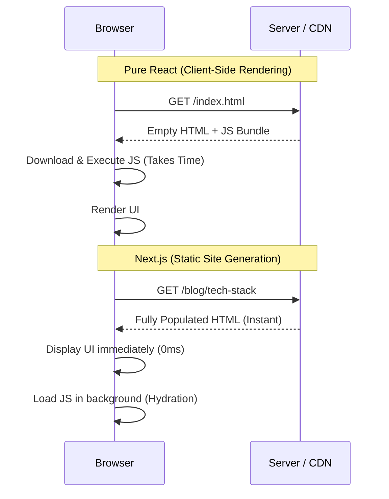
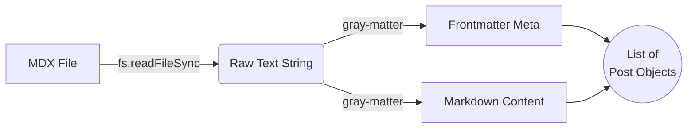

# The Technical Stack & Architecture

This website is designed with a focus on speed, minimalism, and developer experience. Because moving from standard React (Client-Side Rendering) to Next.js introduces new paradigms, this post serves as both documentation and an architectural guide.

<Callout>
  **Note**: This blog is a living project. The stack described here reflects the current architecture as of **April 2026**.
</Callout>

## Understanding Next.js Architecture

If you're coming from a pure React background, you're used to Client-Side Rendering (CSR). In CSR, the browser downloads an empty HTML file and a massive JavaScript bundle, then renders the UI. 

This blog uses Next.js with **Static Site Generation (SSG)**. Instead of sending empty HTML to the user, Next.js executes the React code *on your machine* during the build process (`npm run build`). It generates fully populated HTML files that load instantly in the browser.

### Dynamic Routing (`[slug]`)

In a traditional React app, you might use React Router to define paths like `<Route path="/blog/:id" />`. In the Next.js App Router, routing is driven by the file system. 

When you see a folder named `[slug]`, the brackets indicate a **Dynamic Segment**. For example, navigating to `/blog/tech-stack` tells Next.js to use the `src/app/blog/[slug]/page.tsx` UI template, passing the string `"tech-stack"` to your React component asynchronously as `params.slug`.

### Parsing Markdown to Objects

How do raw `.mdx` files on your hard drive become an array of objects to show on the blog list? 
During the build phase, the `src/lib/posts.ts` utility runs via Node.js:
1. It uses `fs.readdirSync` to read all file names in the `src/content/posts` folder.
2. It uses `fs.readFileSync` to read the raw text of each file.
3. It uses a library called `gray-matter` to extract the "frontmatter"—the block at the very top of the `.mdx` file wrapped in `---` dashes.
4. `gray-matter` parses this block into a JavaScript metadata object (containing `title`, `date`, `description`, etc.) while separating the main text body.

## Content Management with MDX

**[MDX](https://mdxjs.com/)** is Markdown enhanced with JSX. It allows you to write standard Markdown for text formatting (like `# Headings` and `**bold**`), but seamlessly interleave your custom React components.

In our codebase, `MDXRemote` from `next-mdx-remote/rsc` takes the raw markdown content string and dynamically evaluates it on the server. It maps standard HTML tags to customized Tailwind-styled React components, allowing you to use components like the `<Callout>` block right inside the Markdown!

## SEO and Metadata

In standard React, optimizing for Search Engines (SEO) is difficult because raw HTML is sent empty until JavaScript kicks in. Next.js solves this with the built-in Metadata API.

**Why `metadata`?**
The exported `metadata` object in `layout.tsx` is injected statically into the HTML `<head>`. When Google crawlers or social media bots preview your link, they immediately fetch the accurate `<title>`, description, and OpenGraph tags without having to run any JavaScript.

**What is `robots`?**
Inside the metadata object, `robots: { index: true, follow: true }` instructs search engine crawlers:
- `index: true`: You are allowed to catalog this page in Google Search results.
- `follow: true`: You should follow any links on this page to index other parts of our site.

---

## The Rest of the Stack

- **Core Framework**: **Next.js 16+** and **React 19**.
- **Styling**: **Tailwind CSS v4** with a custom dark mode system using `localStorage` and a blocking script to prevent a Flash of Unstyled Content (FOUC).
- **Hosting**: Deployed directly to GitHub Pages using GitHub Actions.

### Inline SVG Performance

Instead of relying on heavy icon node packages (like `react-icons`) or making separate HTTP requests to download PNG images, this blog utilizes the native **Inline SVG** technique.

For specific brand symbols (like the GitHub logo in the footer), we extract the raw geometric path coordinates (e.g., `<path d="M12...">`) from open-source repositories and paste them straight into our React markup. This approach offers massive architectural advantages:

1. **Zero Network Overhead**: The icon mathematically generates instantly alongside the HTML load.
2. **Infinite Scaling**: Vector data never pixelates, remaining razor-sharp across all display resolutions.
3. **Tailwind Symbiosis**: Because the SVG lives natively in the DOM, we can replace hard-coded colors with `fill="currentColor"`. This allows Tailwind classes like `text-neutral-500 hover:text-black` to dynamically manipulate the icon's color without requiring complex Javascript state tracking or `.png` asset swapping.

---

## Manual Theme Control: `darkMode: 'class'` vs `media`

By default, Tailwind CSS uses a `media` strategy, which rigorously follows your Operating System's theme (Windows/macOS settings). We explicitly disabled this in favor of `darkMode: 'class'` mapping for a very specific reason: **Manual Control**.

We switched it over because:

- **Toggle Support:** This blog features a manual theme toggle. If we kept it on `media`, the website would stubbornly ignore your toggle choices and only listen to your computer's built-in system settings.
- **FOUC Prevention:** Using the `class` strategy allows us to run a tiny, render-blocking script in `layout.tsx` that checks `localStorage` and immediately adds the `.dark` class to the `<html>` tag before the initial paint. This entirely prevents the dreaded "flash" of white before the dark theme loads.
- **The Diagram Bug:** Because we are using the new Tailwind v4, the system was trying to inherently invert the Mermaid SVG diagrams based on OS settings, even when the site was toggled to light mode! Enforcing it to be class-based ensures the `dark:invert` utility on the SVGs specifically triggers only when our website actually says it is dark.

In short, it makes the website respect **your toggle button** instead of your OS settings.

### The Mermaid Wireframe Architecture

To achieve the precise "blueprint" aesthetic for architecture diagrams across both themes, we avoided relying on Mermaid's often-unpredictable internal engine. Instead, we built a CSS-first inversion system:

1. **CSS Hijacking**: We placed CSS rules in `globals.css` that aggressively target the generated SVG using `!important`. We force all nodes, texts, and arrows to be explicitly black `#000000` with pure white `#ffffff` backgrounds. This guarantees the diagram is **always** generated as a strict, high-contrast "light mode" wireframe.
2. **Component Wrapper**: In the `<Mermaid />` React component, we wrap the raw SVG string inside a `
` with the Tailwind `dark:invert` utility class.
3. **Seamless Toggling**: 
   - **Light Mode**: The CSS ensures the diagram renders as a clean black-on-white sketch.
   - **Dark Mode**: Tailwind applies a native `filter: invert(1)` to the wrapper. The solid white backgrounds mathematically swap to pitch black, and the black strokes snap to glowing white lines—creating a flawless dark mode wireframe instantly, without relying on JavaScript to recalculate or redraw the SVG elements!

This setup ensures an elite developer experience while delivering unparalleled control and performance to users.
